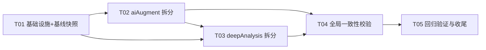

# Stock Analyzer 巨型文件拆分设计方案（lib/deepAnalysis.js + lib/aiAugment.js）

> 作者：架构师（Bob / 高见远） · 版本 v1.0 · 2026-09（基于对两个源文件的全文通读与逐行核对）
> 范围：**只做设计**。本方案给出可执行的拆分蓝图、实现顺序、验证点与风险规避，不包含实现代码。

---

## 0. 源码核对结果（与侦察信息的差异，以实际代码为准）

通读 `lib/deepAnalysis.js`（3009 行）与 `lib/aiAugment.js`（2387 行）后，与主理人侦察信息的核对结论：

**总体吻合**，以下为需要修正/补充的差异点：

| # | 差异点 | 实际代码情况 |
|---|--------|--------------|
| D1 | deepAnalysis.js 导出成员数 | 实际为 **13 个**（非 14）。`module.exports` 在第 3009 行：`{ deepAnalysis, fetchFinancialData, getLocalDocuments, fetchSegmentData, fetchResearchReports, fetchAnnouncements, fetchDividends, persistDividends, loadDividendSeries, classifyDividendStage, dividendLabel, normalizeSymbol, persistValuationScalars }`，与基线清单逐字一致 |
| D2 | deepAnalysis 主流程块边界 | 主流程实际为 **1639–2577 行**：`augmentSections`(1639) → `deepAnalysis`(1758–2138) → `generateConclusion`(2141–2288) → `generateConclusionText`(2290–2479) → `calculateChipDistribution`(2482–2577)。侦察信息说主流程到 2481、下一块从 2586 开始——中间的 2482–2577 正是 `calculateChipDistribution`，归属主流程块，不属"本地文档/分部/研报/公告"块 |
| D3 | 跨块工具函数（拆分的关键难点） | 以下函数被**多个块**使用，搬家时必须显式安置（详见 §9 工具函数归属表）：`fmtPrice`(L23，结论块+主流程用)、`fmtPct`(L1162，结论块+主流程用)、`toYi`(L681，三表块+主流程用)、`_calcStats`(L687，被股息率块 L650 使用)、`_stmtStage`(L703，被财报块 L135/139、三表块、分部块 L2721 使用)、`withTimeout`(L2617，被主流程 L1911 使用)、`aggregateAnnualDPS`(L432 分红块，被股息率块 L554 使用) |
| D4 | 模块级可变状态（deepAnalysis） | `_cninfoOrgCache`(L2902，巨潮 orgId 内存缓存) 是 deepAnalysis 中唯一的模块级内存缓存，归 research 子模块单份持有 |
| D5 | 同名陷阱 | `analyzeValuation`(L964) **内部**有一个局部函数 `calcStats`(L1040)，与模块级 `_calcStats`(L687) 是两个不同的函数。拆分时严禁"顺手合并" |
| D6 | aiAugment 模块级可变状态比侦察的多 | 除 `gSearchMode/gVolcKey/gVolcModel/gBaiduKey`(L150–153) 外，还有 **`_promptCache`(L69，提示词文件缓存)** 与 **`_industryIndexRunning`(L1502，行业指数后台任务去重锁)**，共 6 处。约束 3（状态唯一）必须覆盖全部 6 处 |
| D7 | g* 状态被闭包引用 | `SEARCH_CHANNELS`(L279–299) 的 `getKey/run` 闭包直接引用 `gVolcKey/gVolcModel/gBaiduKey`；`callLLM`(L301–372) 直接读 `gSearchMode`。状态外移后必须经 config 模块的**实时读取**访问，禁止顶层解构快照 |
| D8 | 缓存版本常量被 cache 函数反向依赖 | `readEarningsCache`(L434) 依赖 `EARNINGS_PROMPT_VERSION`(L1791)；`readValuationCache`(L445) 依赖 `VALUATION_VER`(L2274) 与 `SEMI_STATIC_TTL_MS`。这两个常量随 read*Cache 一起迁往 `lib/ai/cache.js`（版本号语义本就是"缓存门控"），earnings/valuation 子模块反向从 cache.js 引入 |
| D9 | 更多跨块工具（aiAugment） | `guardCtxBudget`(L1615，研报块) 被 6 个分析器使用（augmentStock L553、products L893、company L1064、supply L1199、research L1659、announcements L1755）；`extractJson`(L612) 被 7 个分析器使用；`ensureDirs` 被所有分析器使用；`_reportDateToLabel`(L2087，财报块) 被 `analyzeAspects`(L661) 使用；`attachImage`(L990) 被 company/supply 使用（products 内联了自己的下载逻辑，不经过 attachImage）；`extractSources`(L234) 被多个分析器使用 |
| D10 | 延迟 require 确认 | aiAugment 对 deepAnalysis 的延迟 require 确认在两处：L652（`analyzeAspects` 内）与 L1910（`buildLocalEarningsContext` 内，注释明确写了原因："deepAnalysis 顶层依赖 aiAugment（readCache）"）。`lib/factStore.js` L33–36 也是延迟 require（`deep()` 函数），其注释解释了 `aiAugment→factStore→deepAnalysis→aiAugment` 环 |
| D11 | 下游引用方比清单多两个脚本 | 除已列出的 server.js / routes/aiRoutes.js / changeAnalysis / homeHotTopics / hotTopics / sameDayJudgment / factStore 外，`scripts/_test_impact.js:1`（用 `extractEarningsSignal`）与 `scripts/migrateDividends.js:15`（用 `fetchDividends, persistDividends`）也是下游，零改动约束同样适用 |
| D12 | homeHotTopics / hotTopics 实际用到的成员 | 两者整体 `require('./aiAugment')` 后实际只用到 `ai.loadConfig` 与 `ai.callLLM`——但按约束仍走"整体 require 不改"，门面保留全部键即可 |

---

## 1. 目标与硬约束（验收口径）

1. **门面模式**：`lib/deepAnalysis.js` 与 `lib/aiAugment.js` 主文件保留在原路径，`module.exports` 的键名、键序语义、值（函数/对象引用）与现状**逐键一致**（deep 13 键 / ai 24 键，含别名导出 `extractEarningsSignal: _extractEarningsSignal`）。所有下游 require **零改动**。
2. **循环依赖不得恶化**：
   - deepAnalysis 对 `aiAugment.readCache` 的唯一依赖（L13 顶层 require，用于主流程 L2005–2007）**移除**：readCache 迁至 `lib/ai/cache.js`，deepAnalysis 的 pipeline 子模块直接 `require('../ai/cache')`。拆分后 deepAnalysis 门面**不再 require aiAugment**，加载期环彻底消失（改善，而非持平）。
   - aiAugment 对 `deepAnalysis.fetchFinancialData` 的两处延迟 require（迁入 `lib/ai/augmentStock.js` 与 `lib/ai/earnings.js` 后）**原样保持延迟**，位置与调用时机不变。
   - factStore 的 `deep()` 延迟 require 保持不变（其注释可在 T04 顺手更新措辞，属可选）。
3. **模块级可变状态唯一**：6 处状态各自只有一个定义文件，其他模块通过引用/getter 实时访问（见 §7）。
4. **拆分粒度**：每个子模块 100–700 行，按内聚职责分组；仅 `lib/ai/valuation.js`（~120 行）与 `lib/ai/cache.js`（~80 行）低于 300 行，因各自对应独立 API 语义（AI 估值端点 / 缓存只读层）与循环依赖切割点，不与其他块合并。
5. **可回滚**：全部工作在 git 分支 `refactor/split-giant-files` 进行，每个子任务一个 commit，原文件内容随时可从 git 历史恢复。
6. **零新增依赖**：不引入任何第三方包；Node 内置模块（fs/path/axios 既有）不变。

---

## 2. 总体架构

采用 **门面（Facade）+ 领域子模块** 两层结构：

```
lib/
├── deepAnalysis.js        ← 门面（~55 行）：require 子模块 + 13 键 module.exports
├── aiAugment.js           ← 门面（~50 行）：require 子模块 + 24 键 module.exports（含别名）
├── deep/                  ← deepAnalysis 领域子模块（9 个）
│   ├── shared.js          ← 跨块工具与常量（无内部依赖，叶子）
│   ├── financials.js      ← 财报三表 + 股东抓取
│   ├── dividends.js       ← 分红抓取/校准/持久化
│   ├── yield.js           ← 股息率序列与行业对比
│   ├── statements.js      ← 三表分析（营收成本/资产负债/现金流/估值/增长/DCF）
│   ├── conclusions.js     ← 各小节「结论+论证」构建器（21 个 build*）
│   ├── conclusion.js      ← 估值综合结论 generateConclusion(+Text)
│   ├── pipeline.js        ← deepAnalysis 主流程 + augmentSections + calculateChipDistribution
│   └── research.js        ← 本地文档/分部/研报/公告抓取
└── ai/                    ← aiAugment 领域子模块（11 个）
    ├── config.js          ← 常量 + 配置读写 + 全部模块级状态（唯一持有者）
    ├── cache.js           ← 只读缓存层（readCache/readEarningsCache/readValuationCache + 2 个版本常量）
    ├── llm.js             ← LLM 调用/模型选择/搜索通道/上下文预算/JSON 解析
    ├── images.js          ← 图片下载与兜底搜图
    ├── augmentStock.js    ← 个股资料补全 + 投资亮点/雷点
    ├── products.js        ← 产品与客户分析
    ├── company.js         ← 公司介绍 + 供应链 + 股东户数
    ├── market.js          ← 大盘解读 + 行业指数
    ├── research.js        ← 研报总结 + 公告总结
    ├── earnings.js        ← 财报解读（含本地上下文构建 + 全部 _extract* 后处理）
    └── valuation.js       ← AI 估值
```

设计原则：
- **依赖单向**：`shared/config/cache/llm/images` 是叶子；领域子模块只依赖叶子与更底层的领域子模块；pipeline 依赖所有。拆分后两棵子树之间**仅剩两条刻意保留的边**：`deep/pipeline → ai/cache`（静态，替代原顶层 readCache 依赖）与 `ai/{augmentStock,earnings} ⇢ deepAnalysis 门面`（运行期延迟 require，原样保留）。
- **门面零逻辑**：门面文件只有 require 与 module.exports，不含任何业务代码，保证"导出基线"永远一目了然。
- **搬走 + 引回**：每个子模块抽出后，主文件先 `require` 回来并继续导出（保持每一步可运行），最后一步才把门面瘦身为纯 re-export。

---

## 3. deepAnalysis.js 拆分明细

行号区间为源文件中的实际位置（含紧邻注释）。

### 3.1 lib/deep/shared.js（~65 行）
| 成员 | 源行号 | 说明 |
|------|--------|------|
| `UA`, `HEADERS` | 27–32 | 供 financials/yield/research 三处抓取用 |
| `fmtPrice(v)` | 23–25 | 结论块 + 主流程用 |
| `fmtPct(n)` | 1162–1164 | 结论块 + 主流程用（从结论块上移至 shared） |
| `toYi(n)` | 681–684 | 三表块 + 主流程用（从三表块上移） |
| `_calcStats(arr)` | 687–699 | 股息率块 L650 使用（从三表块上移） |
| `_stmtStage(reportName)` | 703–710 | 财报块 L135/139、三表块、分部块 L2721 使用 |
| `withTimeout(promise, ms, fallback)` | 2617–2622 | 主流程 L1911 使用（从尾部上移） |

导出：全部命名导出。**注意**：`_calcStats` 与 `analyzeValuation` 内部局部函数 `calcStats` 是两个东西，shared.js 只收模块级 `_calcStats`（差异点 D5）。

### 3.2 lib/deep/financials.js（~190 行）
| 成员 | 源行号 |
|------|--------|
| `EM_FINANCE_BASE` | 34 |
| `getAnnualDates(years)` | 38–45 |
| `ANALYSIS_YEARS` | 84 |
| `getLatestPartialQuarterDates()` | 88–100 |
| `mergePartialStatements(annual, partial)` | 103–111 |
| `fetchFinancialStatement(type, code, dates)` | 49–81 |
| `fetchFinancialData(code)` | 114–152 |
| `fetchShareholders(code)` | 155–178 |
| `isInstitutionName(name)` | 181–190 |
| `buildShareholderStats(topHolders, totalShares)` | 193–206 |
| `fetchTopShareholders(code)` | 211–256 |

依赖：axios、shared（UA/HEADERS/_stmtStage）。导出（供 pipeline 用）：`fetchFinancialData, fetchShareholders, buildShareholderStats, fetchTopShareholders`（后三个不进门面，仅内部）。

### 3.3 lib/deep/dividends.js（~200 行）
| 成员 | 源行号 |
|------|--------|
| `fetchDividends(code)` | 259–288 |
| `calibrateDividends(code, rows)` | 291–311 |
| `classifyDividendStage(reportDate, plan)` | 315–321 |
| `dividendLabel(year, stage)` | 322–324 |
| `normalizeSymbol(s)` | 327–329 |
| `persistDividends(symbol, emCode, rows)` | 333–359 |
| `loadDividendSeries(symbol)` | 362–387 |
| `persistValuationScalars(symbol, emCode, valuation)` | 392–428 |
| `aggregateAnnualDPS(dividends)` | 432–440 |

依赖：`./db`、shared（UA/HEADERS）。导出：上表全部（`aggregateAnnualDPS` 供 yield.js 用；门面只导出基线 13 键中的 7 个：fetchDividends/persistDividends/loadDividendSeries/classifyDividendStage/dividendLabel/normalizeSymbol/persistValuationScalars）。

### 3.4 lib/deep/yield.js（~250 行）
| 成员 | 源行号 |
|------|--------|
| `fetchBfqBars(tencentCode, count, endDate)` | 445–461 |
| `fetchAllBfqBars(tencentCode, years)` | 464–494 |
| `closeOnOrBefore(bars, dateStr)` | 497–502 |
| `yearEndCloseFromBars(bars, y)` | 505–510 |
| `fetchReportPublishDates(code)` | 513–537 |
| `computeCurrentYield(dividends, price)` | 541–561 |
| `buildInsuranceIndustryYield(symbol, dividends, quote, companyCurrentYield)` | 564–588 |
| `analyzeDividendYield(dividends, quote, symbol, name)` | 592–676 |

依赖：axios、`./stockData`(getQuote, detectMarket)、`./insuranceAnalysis`(isInsuranceCompany)、shared（UA/_calcStats）、`./dividends`（fetchDividends, aggregateAnnualDPS）。导出：`analyzeDividendYield`（仅 pipeline 用）。

### 3.5 lib/deep/statements.js（~500 行）
| 成员 | 源行号 |
|------|--------|
| `_STAGE_ORDER` | 711 |
| `_calcTtmProfit(income)` | 715–729 |
| `_stmtFlow(r)` | 732–744 |
| `_mapRevenueCost(r, year, opts)` | 747–774 |
| `analyzeRevenueCost(income)` | 778–830 |
| `analyzeBalanceSheet(balance)` | 833–897 |
| `_cfFlow(r)` | 901–907 |
| `analyzeCashFlow(cashflow, income, rcData)` | 908–961 |
| `analyzeValuation(financialData, quote, shareholders, emValuation)` | 964–1084 |
| `analyzeGrowth(revenueCostData)` | 1087–1103 |
| `calculateDCF(financialData, balance, quote, shareholders)` | 1106–1159 |

依赖：shared（toYi/_stmtStage）。导出：`analyzeRevenueCost, analyzeBalanceSheet, analyzeCashFlow, analyzeValuation, analyzeGrowth, calculateDCF`。**保留局部 `calcStats`（L1040）原样不动**。

### 3.6 lib/deep/conclusions.js（~490 行）
| 成员 | 源行号 |
|------|--------|
| `buildRevenueConclusion` / `buildCashFlowConclusion` / `buildGrowthConclusion` / `buildMarginConclusion` | 1166–1238 |
| `analyzeRoeMarginTrend(revenueCostData, quote)` | 1244–1314 |
| `buildBalanceConclusion` / `buildDividendConclusion` / `buildDCFConclusion` / `buildAssetCompConclusion` / `buildLiabCompConclusion` / `buildMarketCapConclusion` | 1316–1409 |
| `buildProfitVsCashConclusion` / `buildRevVsCostConclusion` / `buildRevVsExpConclusion` / `buildPayableConclusion` / `buildValuationMetricConclusion` / `buildDivYieldConclusion` | 1411–1502 |
| `segmentTopItems` / `buildSegmentProductConclusion` / `buildSegmentRegionConclusion` / `buildProductMarginConclusion` | 1504–1558 |
| `buildInsurancePremiumConclusion` … `buildInsuranceDDMConclusion`（7 个保险结论） | 1561–1617 |
| `buildBusinessLineConclusion` / `buildValuationReasoning` | 1619–1633 |

依赖：shared（fmtPrice/fmtPct）、`./valuationHub`(formatValuationLine，L1482 使用)。导出：全部 build* + `analyzeRoeMarginTrend`（仅 augmentSections 用）。

### 3.7 lib/deep/conclusion.js（~350 行）
| 成员 | 源行号 |
|------|--------|
| `generateConclusion(dcf, valuation, growth, cashFlowData, revenueCostData, balanceAnalysis, auditOpinion, shareholders, companyType, dividends, quote, insuranceAnalysis)` | 2141–2288 |
| `generateConclusionText(rating, price, dcf, valuation, growth, cashFlowData, revenueCostData, auditOpinion, ratings, companyType, dividends, quote, insuranceAnalysis, fairValueCenter, fairValueRange)` | 2290–2479 |

依赖：shared（fmtPrice/fmtPct/toYi）、`./valuationHub`(formatValuationLine，L2387/2404)。导出：`generateConclusion`（generateConclusionText 仅被其内部调用，不导出）。单独成文件的原因：主流程块近 940 行超出 700 行粒度上限，且"估值综合结论"与"主流程编排"是两个内聚职责。

### 3.8 lib/deep/pipeline.js（~610 行）
| 成员 | 源行号 |
|------|--------|
| `augmentSections(sections, ctx)` | 1639–1755 |
| `deepAnalysis(symbol, name, quote, history)`（主入口） | 1758–2138 |
| `calculateChipDistribution(history, authoritativePrice)` | 2482–2577 |

依赖：`./stockData`(detectMarket)、`./insuranceAnalysis`(analyzeInsuranceCompany)、`./companyType`(classifyCompanyType)、`./docStore`、`./db`、`./futuresData`(getFuturesMeta)、`./changeAnalysis`(analyzeChangesForSymbol)、`./eastmoneyValuation`(fetchValuationTTM)、`./valuationHub`(getValuationHub, beginSnapshot, wrapQuote 由 quoteHub)、`./financeHub`(getFinanceHub, formatFinanceLine)、`./quoteHub`(getQuoteHub, wrapQuote)、shared（全部）、**`../ai/cache`（readCache —— 替代原 `require('./aiAugment')` 顶层依赖，循环依赖切割点）**、以及 deep 下其余 7 个子模块。导出：`deepAnalysis`。

**关键改动（唯一一处非纯搬运的代码变更）**：原 L13 `const { readCache } = require('./aiAugment')` 删除；pipeline.js 内改为 `const { readCache } = require('../ai/cache')`。函数体零改动。

### 3.9 lib/deep/research.js（~440 行）
| 成员 | 源行号 |
|------|--------|
| `getLocalDocuments(stockCode)` | 2586–2614 |
| `_segPct(v)` | 2629–2632 |
| `fetchSegmentData(emCode)` | 2633–2738 |
| `buildProductGrossMargin(segmentData)` | 2741–2816 |
| `fetchResearchReports(stockCode)` | 2819–2843 |
| `classifyAnnouncement(title)` | 2847–2856 |
| `ANNO_CATEGORY_LABEL` | 2858–2866（本文件内未被引用，保持原样以维持源码一致性，不删除） |
| `parseAnnouncementFields(text, category)` | 2869–2899 |
| `_cninfoOrgCache`（模块级 Map，**本子模块唯一持有**） | 2902 |
| `fetchCninfoOrgId(stockCode)` | 2903–2921 |
| `fetchCninfoAnnouncements(stockCode, stockName)` | 2925–2975 |
| `fetchAnnouncementsEastmoney(stockCode)` | 2978–2998 |
| `fetchAnnouncements(stockCode, stockName)` | 3001–3007 |

依赖：axios、`./docStore`、shared（UA/HEADERS/_stmtStage，L2721 用 _stmtStage）。导出：`getLocalDocuments, fetchSegmentData, buildProductGrossMargin, fetchResearchReports, fetchAnnouncements`。

### 3.10 门面 lib/deepAnalysis.js（~55 行）

```js
// lib/deepAnalysis.js —— 门面：仅 re-export，导出基线与拆分前逐键一致（13 键）
const pipeline   = require('./deep/pipeline');
const financials = require('./deep/financials');
const dividends  = require('./deep/dividends');
const research   = require('./deep/research');

module.exports = {
  deepAnalysis: pipeline.deepAnalysis,
  fetchFinancialData: financials.fetchFinancialData,
  getLocalDocuments: research.getLocalDocuments,
  fetchSegmentData: research.fetchSegmentData,
  fetchResearchReports: research.fetchResearchReports,
  fetchAnnouncements: research.fetchAnnouncements,
  fetchDividends: dividends.fetchDividends,
  persistDividends: dividends.persistDividends,
  loadDividendSeries: dividends.loadDividendSeries,
  classifyDividendStage: dividends.classifyDividendStage,
  dividendLabel: dividends.dividendLabel,
  normalizeSymbol: dividends.normalizeSymbol,
  persistValuationScalars: dividends.persistValuationScalars,
};
```

要点：
- **键序与原 module.exports（L3009）完全一致**（虽然 JS 对象键序对 `Object.keys` 按插入序枚举，保持原序可让快照 diff 逐字节对齐）。
- `db` 等共享依赖由各子模块自行 require，门面不转发。
- 门面**不再 require aiAugment**（循环依赖切割点，见 §7.1）。

---

## 4. aiAugment.js 拆分明细

### 4.1 lib/ai/config.js（~180 行）—— 常量、配置与全部模块级状态的唯一持有者
| 成员 | 源行号 |
|------|--------|
| `UA` | 54 |
| `DATA_DIR` / `CONFIG_PATH` / `CACHE_DIR` / `IMG_DIR` | 56–59 |
| `CACHE_TTL_MS` / `SEMI_STATIC_TTL_MS` | 62–65 |
| `PROMPTS_DIR` + `_promptCache`（状态①）+ `loadPromptFile(name)` | 68–84 |
| `PROVIDERS`（常量对象，门面原样导出**同一引用**） | 86–105 |
| `ensureDirs()` | 107–113 |
| `SEARCH_MODES` / `normSearchMode(mode)` | 116–119 |
| `EMPTY_CONFIG` / `loadConfig()` | 121–147 |
| **`runtime`（状态②–⑤，替代 gSearchMode/gVolcKey/gVolcModel/gBaiduKey，L150–153）** | 改写为对象 |
| `setSearchMode(mode)` / `setSearchCreds(c)` | 154–161（改为写 runtime） |
| `saveConfig(cfg)` | 163–185 |
| `publicConfig(c)` | 187–201（内用 `getAliMcpQuotaState`，需 require `./webSearchMcp`） |
| 载入期初始化块（L204–208，从已存配置恢复 runtime） | 204–208 |

**状态改造说明**（约束 3 的落实）：
```js
// 唯一一份进程内生效状态（原 4 个 let 变量收拢为一个对象，引用语义不变）
const runtime = { searchMode: 'builtin', volcKey: '', volcModel: '', baiduKey: '' };
function setSearchMode(mode) { runtime.searchMode = normSearchMode(mode); }
function setSearchCreds(c) {
  runtime.volcKey = (c && c.volcApiKey) || '';
  runtime.volcModel = (c && c.volcModel) || '';
  runtime.baiduKey = (c && c.baiduApiKey) || '';
}
module.exports = { ..., runtime, setSearchMode, setSearchCreds, ... };
```
**铁律**：llm.js 等消费方必须在**调用时**读 `config.runtime.searchMode`，**禁止**在模块顶层 `const { searchMode } = require('./ai/config')` 这类解构快照（会把可变状态冻结在旧值）。

### 4.2 lib/ai/cache.js（~80 行）—— 循环依赖切割点
| 成员 | 源行号 | 说明 |
|------|--------|------|
| `EARNINGS_PROMPT_VERSION` | 1791 | 随 readEarningsCache 迁入（缓存版本门控语义） |
| `VALUATION_VER` | 2274 | 随 readValuationCache 迁入 |
| `readCache(symbol, suffix)` | 422–430 | **deepAnalysis pipeline 直接 require 本模块（不再经过 aiAugment）** |
| `readEarningsCache(symbol)` | 434–439 | 下游 sameDayJudgment 经门面使用 |
| `readValuationCache(symbol)` | 445–458 | 下游 aiRoutes L167 经门面使用 |

依赖：fs/path、`./config`（CACHE_DIR, SEMI_STATIC_TTL_MS）。导出：全部 5 个成员。earnings.js / valuation.js **从本模块反向引入**两个版本常量（依赖方向：earnings→cache、valuation→cache，均单向无环）。

### 4.3 lib/ai/llm.js（~300 行）
| 成员 | 源行号 | 说明 |
|------|--------|------|
| `buildRequestBody` / `isNoSearchModel` | 210–232 | |
| `extractSources(text)` | 234–238 | 多个分析器用 |
| `extractUserQuery` / `injectSearchResults` | 250–272 | |
| `SEARCH_CHANNELS` | 279–299 | `getKey/run` 改为读 `config.runtime.volcKey/volcModel/baiduKey`（实时读取） |
| `callLLM(provider, apiKey, model, messages, opts)` | 301–372 | `gSearchMode` 改读 `config.runtime.searchMode` |
| `pickModelFor(cfg, kind)` / `pickLocalSummaryModel(cfg)` | 376–402 | |
| `postLLM(url, apiKey, body, timeoutMs)` | 404–419 | |
| `guardCtxBudget(cfg, modelPick, ctxLen, tag, symbol)` | 1615–1624 | 从研报块上移（6 处跨块使用） |
| `LOCAL_CTX_CHAR_BUDGET` / `DEFAULT_LOCAL_CTX_CHAR_BUDGET` | 1795–1796 | 随 guardCtxBudget 上移 |
| `extractJson(text)` | 612–621 | 从 augmentStock 块上移（7 处跨块使用） |

依赖：axios、`./config`（PROVIDERS/runtime）、`./webSearchMcp`、`./volcSearch`、`./miaoxiang`。导出：全部。

### 4.4 lib/ai/images.js（~95 行）
| 成员 | 源行号 |
|------|--------|
| `downloadImage(url, destPath)` | 740–763 |
| `searchCommonsImage(query)` | 766–806 |
| `attachImage(symbol, prefix, url, query)` | 990–1005 |

依赖：axios、fs、`./config`（UA, IMG_DIR）。导出：全部（products.js 用 downloadImage/searchCommonsImage；company.js 用 attachImage）。

### 4.5 lib/ai/augmentStock.js（~290 行）
| 成员 | 源行号 |
|------|--------|
| `AUGMENT_WEB_SYSTEM_PROMPT` / `AUGMENT_LOCAL_SYSTEM_PROMPT` | 460–479 |
| `buildAugmentContext(symbol, stockName)` | 482–516 |
| `augmentStock({ symbol, stockName, industry, force })` | 518–595 |
| `ASPECTS_SYSTEM_PROMPT` | 597–610 |
| `analyzeAspects({ symbol, stockName, industry, force })` | 623–737 |

依赖：`./config`、`./llm`（callLLM/pickModelFor/pickLocalSummaryModel/extractJson/extractSources）、`./shareholderData`(getCompanyProfile)、`./factStore`、`./financeHub`（L651 延迟 require 原样）、**`../deepAnalysis`（L652 延迟 require 原样保留，含原注释）**、`./earnings`（`_reportDateToLabel`，L661 使用）。导出：`augmentStock, analyzeAspects`（另导出 `buildAugmentContext` 供门面备用，不进门面导出表）。

### 4.6 lib/ai/products.js（~190 行）
`PRODUCTS_WEB_SYSTEM_PROMPT`(808–815)、`PRODUCTS_LOCAL_SYSTEM_PROMPT`(818–825)、`buildProductsContext(segment)`(828–846)、`analyzeProducts(...)`(848–987)。依赖：config/llm/images/factStore/shareholderData。导出：`analyzeProducts`。

### 4.7 lib/ai/company.js（~390 行）
`COMPANY_SYSTEM_PROMPT`(1007–1014)、`COMPANY_LOCAL_SYSTEM_PROMPT`(1017–1026)、`analyzeCompany(...)`(1028–1135)、`SUPPLY_SYSTEM_PROMPT`(1137–1146)、`SUPPLY_LOCAL_SYSTEM_PROMPT`(1149–1160)、`analyzeSupplyChain(...)`(1162–1273)、`HOLDERS_SYSTEM_PROMPT`(1275–1279)、`HOLDERS_LOCAL_SYSTEM_PROMPT`(1282–1290)、`buildLocalHoldersContext(symbol)`(1293–1315，内含对 `./shareholderData` 的函数内 require，原样保留)、`analyzeShareholdersAI(...)`(1317–1383)。依赖：config/llm/images/factStore/shareholderData。导出：`analyzeCompany, analyzeSupplyChain, analyzeShareholdersAI`。

### 4.8 lib/ai/market.js（~210 行）
`MARKET_OVERVIEW_TTL_MS`(1386)、`MARKET_OVERVIEW_PROMPT`(1387–1396)、`analyzeMarketOverview(...)`(1398–1468)、`INDUSTRY_INDEX_TTL_MS`(1471)、`safeName(s)`(1473–1475)、`industryIndexCacheFile(induCode, industryName)`(1476–1479)、`readIndustryIndexCache(induCode, industryName)`(1480–1488)、`INDUSTRY_INDEX_PROMPT`(1490–1499)、**`_industryIndexRunning`（状态⑥，本子模块唯一持有）**(1502)、`analyzeIndustryIndex(...)`(1504–1589)。依赖：config/llm。导出：`analyzeMarketOverview, analyzeIndustryIndex, readIndustryIndexCache`。

### 4.9 lib/ai/research.js（~200 行）
`RESEARCH_SYSTEM_PROMPT`(1592–1600)、`RESEARCH_LOCAL_SYSTEM_PROMPT`(1603–1611)、`analyzeResearchReports(...)`(1626–1691)、`ANNOUNCEMENT_SYSTEM_PROMPT`(1694–1704)、`ANNOUNCEMENT_LOCAL_SYSTEM_PROMPT`(1707–1720)、`analyzeAnnouncements(...)`(1722–1787)。依赖：config/llm/factStore/shareholderData。导出：`analyzeResearchReports, analyzeAnnouncements`。

### 4.10 lib/ai/earnings.js（~490 行）
| 成员 | 源行号 |
|------|--------|
| `EARNINGS_SYSTEM_PROMPT` | 1798–1821 |
| `EARNINGS_LOCAL_SYSTEM_PROMPT` | 1826–1851 |
| `pickReportDoc(docs, reportDate)` | 1863–1904 |
| `buildLocalEarningsContext(symbol, opts)` | 1906–2063（**L1910 对 deepAnalysis 的延迟 require 原样保留**） |
| `_extractReportPeriod(content)` | 2065–2070 |
| `_extractEarningsTarget(content)` | 2074–2084 |
| `_reportDateToLabel(reportDate)` | 2087–2097（被 augmentStock.js L661 使用，导出） |
| `_detectCitedYear(text)` | 2101–2105（被 augmentStock.js L710 使用，导出） |
| `_extractEarningsSignal(content)` | 2109–2126（保持原名，门面以别名导出） |
| `_extractEarningsVerdict(content)` | 2129–2134 |
| `_postProcessEarningsSummary(text, maxChars)` | 2140–2181 |
| `analyzeEarningsReport({...})` | 2183–2269 |

依赖：fs/path、`./config`（loadConfig/ensureDirs/CACHE_DIR/CACHE_TTL_MS）、`./llm`（callLLM/pickModelFor）、`./cache`（EARNINGS_PROMPT_VERSION）、`./shareholderData`、`./pdfText`（L2004 函数内 require，原样）、`./docStore`/`./financeHub`（L1911–1912 函数内 require，原样）、`../deepAnalysis`（L1910 延迟 require，原样）。导出：`analyzeEarningsReport, buildLocalEarningsContext` + 4 个内部工具（`_extractEarningsSignal, _reportDateToLabel, _detectCitedYear, _postProcessEarningsSummary`，供门面别名导出与 augmentStock 复用）。

### 4.11 lib/ai/valuation.js（~120 行）
`analyzeValuation({ symbol, stockName, industry, force, companyName })`（2275–2384）。依赖：`./config`、`./llm`（callLLM/pickModelFor/loadPromptFile）、`./cache`（VALUATION_VER）、`./earnings`（buildLocalEarningsContext，L2292）、`./shareholderData`。导出：`analyzeValuation`。

### 4.12 门面 lib/aiAugment.js（~50 行）

```js
// lib/aiAugment.js —— 门面：仅 re-export，导出基线与拆分前逐键一致（24 键，键序与原 L2386-2387 一致）
const config    = require('./ai/config');
const cache     = require('./ai/cache');
const llm       = require('./ai/llm');
const augment   = require('./ai/augmentStock');
const products  = require('./ai/products');
const company   = require('./ai/company');
const market    = require('./ai/market');
const research  = require('./ai/research');
const earnings  = require('./ai/earnings');
const valuation = require('./ai/valuation');

module.exports = {
  augmentStock: augment.augmentStock,
  analyzeAspects: augment.analyzeAspects,
  analyzeProducts: products.analyzeProducts,
  analyzeCompany: company.analyzeCompany,
  analyzeSupplyChain: company.analyzeSupplyChain,
  analyzeShareholdersAI: company.analyzeShareholdersAI,
  analyzeMarketOverview: market.analyzeMarketOverview,
  analyzeIndustryIndex: market.analyzeIndustryIndex,
  analyzeResearchReports: research.analyzeResearchReports,
  analyzeAnnouncements: research.analyzeAnnouncements,
  analyzeEarningsReport: earnings.analyzeEarningsReport,
  analyzeValuation: valuation.analyzeValuation,
  readIndustryIndexCache: market.readIndustryIndexCache,
  loadConfig: config.loadConfig,
  saveConfig: config.saveConfig,
  publicConfig: config.publicConfig,
  readCache: cache.readCache,
  readEarningsCache: cache.readEarningsCache,
  readValuationCache: cache.readValuationCache,
  extractEarningsSignal: earnings._extractEarningsSignal,   // ← 别名导出，原样保留
  PROVIDERS: config.PROVIDERS,                               // ← 同一对象引用
  callLLM: llm.callLLM,
  pickModelFor: llm.pickModelFor,
  buildLocalEarningsContext: earnings.buildLocalEarningsContext,
};
```

---

## 5. 模块依赖图

```mermaid
graph TD
    subgraph 门面（原路径，导出基线不变）
        FAC-D[lib/deepAnalysis.js · 13键]
        FAC-A[lib/aiAugment.js · 24键]
    end

    subgraph lib/deep
        shared[deep/shared]
        fin[deep/financials]
        div[deep/dividends]
        yld[deep/yield]
        stmt[deep/statements]
        conc[deep/conclusions]
        concl[deep/conclusion]
        pipe[deep/pipeline]
        res[deep/research]
    end

    subgraph lib/ai
        cfg[ai/config ★状态唯一持有]
        cache[ai/cache ★循环切割点]
        llm[ai/llm]
        img[ai/images]
        aug[ai/augmentStock]
        prod[ai/products]
        comp[ai/company]
        mkt[ai/market]
        rsh[ai/research]
        earn[ai/earnings]
        val[ai/valuation]
    end

    %% deep 内部
    fin --> shared
    div --> shared
    yld --> shared
    yld --> div
    stmt --> shared
    conc --> shared
    concl --> shared
    pipe --> shared
    pipe --> fin
    pipe --> div
    pipe --> yld
    pipe --> stmt
    pipe --> conc
    pipe --> concl
    pipe --> res

    %% ai 内部
    cache --> cfg
    llm --> cfg
    img --> cfg
    aug --> cfg
    aug --> llm
    aug --> earn
    prod --> cfg
    prod --> llm
    prod --> img
    comp --> cfg
    comp --> llm
    comp --> img
    mkt --> cfg
    mkt --> llm
    rsh --> cfg
    rsh --> llm
    earn --> cfg
    earn --> llm
    earn --> cache
    val --> cfg
    val --> llm
    val --> cache
    val --> earn

    %% 门面
    FAC-D --> pipe
    FAC-D --> fin
    FAC-D --> div
    FAC-D --> res
    FAC-A --> aug
    FAC-A --> prod
    FAC-A --> comp
    FAC-A --> mkt
    FAC-A --> rsh
    FAC-A --> earn
    FAC-A --> val
    FAC-A --> cache
    FAC-A --> llm
    FAC-A --> cfg

    %% 跨树（关键）
    pipe -. "readCache（静态 require，替代原顶层 aiAugment 依赖）" .-> cache
    aug -. "fetchFinancialData（运行期延迟 require，原样保留 L652）" .-> FAC-D
    earn -. "fetchFinancialData（运行期延迟 require，原样保留 L1910）" .-> FAC-D
```

**循环依赖处理结论**：
1. 原环 `deepAnalysis → aiAugment → (factStore) → deepAnalysis` 中，deepAnalysis→aiAugment 这条边被替换为 `deep/pipeline → ai/cache`（ai/cache 不依赖 deep 树），**加载期环消失**。factStore 的 `deep()` 延迟 require 因此更安全，保持不变。
2. `ai/augmentStock ⇢ deepAnalysis` 与 `ai/earnings ⇢ deepAnalysis` 两条运行期延迟 require **原样保留**（硬约束 2）。拆分后虽然顶层 require 在理论上已可行（deep 门面不再引用 ai 树），但**不改**：延迟 require 是已验证的稳定形态，改动了会增加回归面且违反约束。
3. 新依赖图中不存在任何模块级加载环（所有虚线边均为运行期触发）。

---

## 6. 门面改造说明

| 项目 | lib/deepAnalysis.js | lib/aiAugment.js |
|------|--------------------|--------------------|
| 保留内容 | 仅 `require` 4 个子模块 + `module.exports` 13 键 | 仅 `require` 10 个子模块 + `module.exports` 24 键 |
| re-export 写法 | 逐键 `key: submodule.key`（§3.10 示例），键序与原 L3009 一致 | 逐键 + **别名键** `extractEarningsSignal: earnings._extractEarningsSignal` + **引用键** `PROVIDERS: config.PROVIDERS`（同一对象引用，非拷贝）（§4.12 示例） |
| 删除内容 | 原 3009 行函数体全部迁出；**顶层 `require('./aiAugment')` 删除** | 原 2387 行函数体全部迁出；顶层 require 全部迁往子模块 |
| 预计行数 | ~55 | ~50 |
| 下游影响 | server.js L20/L1029、factStore L36、scripts/migrateDividends.js：零改动 | server.js L45、aiRoutes L16/L167、changeAnalysis L16、homeHotTopics L17、hotTopics L17、sameDayJudgment L48、scripts/_test_impact.js：零改动 |

---

## 7. 关键设计决策

### 7.1 readCache 的归置（约束 2 的决策与理由）
**决策**：readCache/readEarningsCache/readValuationCache + EARNINGS_PROMPT_VERSION + VALUATION_VER 一并迁至独立子模块 `lib/ai/cache.js`；deepAnalysis 的 pipeline 子模块**静态 require** `../ai/cache`；门面从 cache.js re-export 保持下游零改动。

**否决的备选**：主文件把 readCache 注入子模块（依赖注入式）——否决理由：① 注入需要在 pipeline 导出前完成装配，初始化顺序隐晦、易被后人破坏；② cache.js 天然是零业务依赖的叶子（只依赖 config 的 CACHE_DIR），静态 require 无任何环风险；③ readEarningsCache/readValuationCache 本就依赖两个版本常量，单独成模块让"版本常量 ↔ 缓存门控"的配对关系显式化，避免常量滞留 earnings/valuation 造成 cache→earnings 反向依赖。

### 7.2 模块级可变状态唯一（约束 3 的落实，共 6 处）
| 状态 | 唯一持有文件 | 访问方式 |
|------|--------------|----------|
| `_promptCache`（提示词 mtime 缓存） | lib/ai/config.js | loadPromptFile 内部，不导出 |
| `runtime.{searchMode,volcKey,volcModel,baiduKey}`（原 g* 四变量） | lib/ai/config.js | llm.js/SEARCH_CHANNELS 调用时读 `config.runtime.*`；setSearchMode/setSearchCreds 写入；config.js 载入期初始化块恢复 |
| `_industryIndexRunning` | lib/ai/market.js | analyzeIndustryIndex 内部 |
| `_cninfoOrgCache` | lib/deep/research.js | fetchCninfoOrgId 内部 |

红线：**任何模块不得在顶层解构 runtime**（`const { searchMode } = config` ✗）；SET 前读后写必须穿透同一对象引用。`gSearchMode` 等旧变量名在代码中彻底消失（grep 断言，见 §10）。

### 7.3 别名导出与引用导出
- `extractEarningsSignal: _extractEarningsSignal`：earnings.js 内保持函数原名 `_extractEarningsSignal`，门面以别名键导出——下游（sameDayJudgment、server、_test_impact.js）看到的键名不变。
- `PROVIDERS`：config.js 定义一次，门面导出**同一引用**；saveConfig→publicConfig→getAliMcpQuotaState 链路全部留在 config.js，对象身份与现状一致。

### 7.4 缓存路径与目录常量
`DATA_DIR/CONFIG_PATH/CACHE_DIR/IMG_DIR/PROMPTS_DIR` 字符串**逐字节保持**（`path.join(__dirname,'..','data')` 等）。注意：迁入 lib/ai/config.js 后 `__dirname` 变为 `lib/ai`，因此这些 path.join 的相对层级**必须**改为 `path.join(__dirname,'..','..','data')`——这是唯一允许且必须做的"路径算术"改动，改完必须用 §10-C 的缓存命中测试验证（否则 7 天缓存全部失效）。同理 valuation.js 中 `path.join(__dirname,'..','data','cache','deep-analysis')` 迁入 lib/ai 后需调整为 `../../data/cache/deep-analysis`。

### 7.5 延迟 require 保全清单
| 位置 | 迁移后位置 | 处理 |
|------|-----------|------|
| aiAugment L651–652（financeHub + deepAnalysis，analyzeAspects 内） | lib/ai/augmentStock.js | **原样保留**（含注释） |
| aiAugment L1909–1912（deepAnalysis + financeHub + docStore，buildLocalEarningsContext 内） | lib/ai/earnings.js | **原样保留**（含注释） |
| aiAugment L2004（pdfText） | lib/ai/earnings.js | 原样保留 |
| aiAugment L1295（shareholderData，buildLocalHoldersContext 内） | lib/ai/company.js | 原样保留 |
| factStore L35–37 `deep()` | 不动 | 原样保留（注释措辞可在 T04 更新，注明 deepAnalysis 已不再顶层依赖 aiAugment） |
| deepAnalysis L1761（`require('./stockData').detectMarket`，函数内） | lib/deep/pipeline.js | 原样保留 |

---

## 8. 实现顺序（每步含验证点）

> 原则：**自底向上抽叶子，主文件每一步"搬走 + require 回来 + 继续导出"，全程可运行可提交**；两个门面最后一步才瘦身为纯 re-export。

**T01 基础设施与导出基线快照**（P0，依赖：无）
- 建分支 `refactor/split-giant-files`；新建 `scripts/export-snapshot.js`：dump 两个门面的 `Object.keys(module.exports)` + 每键 `typeof`（函数/object）到 `scripts/export-baseline.json` 并提交；建 `lib/deep/`、`lib/ai/` 目录骨架。
- ✅ 验证：`node scripts/export-snapshot.js` 生成基线（deep 13 键 / ai 24 键）；`node -e "require('./lib/deepAnalysis');require('./lib/aiAugment')"` 无异常。

**T02 aiAugment 拆分**（P0，依赖：T01）
- 抽取顺序（自底向上，每抽一个子模块提交一次）：
  1. `ai/config.js`（状态收拢 runtime 化）→ 2. `ai/cache.js`（版本常量随迁）→ 3. `ai/llm.js`（含 guardCtxBudget/extractJson 上移）→ 4. `ai/images.js` → 5. `ai/market.js` → 6. `ai/research.js` → 7. `ai/products.js` → 8. `ai/company.js` → 9. `ai/earnings.js` → 10. `ai/valuation.js` → 11. `ai/augmentStock.js` → 12. 门面瘦身。
- 每步验证：`node scripts/export-snapshot.js && git diff scripts/export-snapshot.out` 零差异；`node -e "require('./lib/aiAugment')"` 无异常。
- 关键中间验证（第 1 步后）：`node -e "const c=require('./lib/ai/config');c.setSearchMode('volc');console.log(c.runtime.searchMode)"` → `volc`；第 3 步后确认 SEARCH_CHANNELS 的 getKey 读的是 `config.runtime`；第 12 步后额外跑 `scripts/_test_impact.js`（extractEarningsSignal 路径）。

**T03 deepAnalysis 拆分**（P0，依赖：T02——pipeline 需 `lib/ai/cache.js` 已存在）
- 抽取顺序：1. `deep/shared.js` → 2. `deep/financials.js` → 3. `deep/dividends.js` → 4. `deep/yield.js` → 5. `deep/research.js` → 6. `deep/statements.js` → 7. `deep/conclusions.js` → 8. `deep/conclusion.js` → 9. `deep/pipeline.js`（**同时切换 readCache 来源为 `../ai/cache`**）→ 10. 门面瘦身。
- 每步验证：快照零差异 + `node -e "require('./lib/deepAnalysis')"`；第 9 步后额外断言：`grep -n "aiAugment" lib/deepAnalysis.js lib/deep/*.js` **无任何匹配**（循环依赖切割完成）；`node -e "require('./lib/factStore')"`（触发 factStore→deepAnalysis 门面链）无异常。

**T04 全局一致性与状态唯一性校验**（P0，依赖：T02+T03）
- 一次性断言脚本（可写入 `scripts/check-split.js` 供 QA 复用）：
  - 快照比对：`Object.keys` + `typeof` 与基线**逐键一致**（deep 13 / ai 24，含 `extractEarningsSignal` 键存在）。
  - `node --check` 遍历 lib/、lib/deep/、lib/ai/ 全部 .js。
  - 状态唯一性 grep：`gSearchMode|gVolcKey|gVolcModel|gBaiduKey` 在 lib/ 下**零功能性匹配**（QA 实测：lib/ai/config.js 有 2 处 g* 字样为迁移说明注释，属预期豁免；断言应排除注释行）；`_promptCache` 仅 config.js 定义；`_industryIndexRunning` 仅 market.js；`_cninfoOrgCache` 仅 deep/research.js；`runtime` 解构红线 grep（`\{[^}]*searchMode[^}]*\}\s*=\s*require` 零匹配）。
  - require 边 grep：`require('./aiAugment')` 仅剩下游 7 处（changeAnalysis/homeHotTopics/hotTopics/sameDayJudgment/server/aiRoutes/_test_impact）；`require('./deepAnalysis')` 仅剩 factStore（延迟）+ ai/augmentStock + ai/earnings（延迟）。
  - 缓存路径校验：`node -e` 打印 `config.CACHE_DIR` 与拆分前逐字节一致（`…\data\ai_cache`）。
- ✅ 验证：全部断言绿；提交 tag `refactor-split-done`。

**T05 回归验证与收尾**（P1，依赖：T04，与 QA 协作执行 §10 方案）
- 启动冒烟 + 只读端点验证 + 缓存兼容验证；可选：更新 factStore L33 注释措辞（唯一允许的注释级改动）。

任务依赖图：


---

## 9. 风险清单与规避措施

| # | 风险 | 影响 | 规避措施 |
|---|------|------|----------|
| R1 | **跨块工具函数漏搬**（fmtPrice/fmtPct/toYi/_calcStats/_stmtStage/withTimeout/aggregateAnnualDPS/_reportDateToLabel/guardCtxBudget/extractJson/extractSources/attachImage/ensureDirs/pickLocalSummaryModel） | ReferenceError 或行为分叉 | 已在 §3/§4 逐一给出归属表与使用行号；执行时每搬一块跑 smoke；`_reportDateToLabel`/`_detectCitedYear` 从 earnings.js 导出供 augmentStock.js 引用 |
| R2 | **别名导出丢失**（`extractEarningsSignal: _extractEarningsSignal`） | sameDayJudgment/server/_test_impact 直接挂 | 门面显式别名键（§4.12）；T04 快照断言该键存在且 typeof==='function' |
| R3 | **可变状态被复制/快照化**（runtime 化后有人顶层解构；或两处定义） | 搜索通道/凭据改了不生效，或配置串台 | 状态唯一持有表（§7.2）+ T04 grep 断言 + 代码评审红线"禁止顶层解构 runtime" |
| R4 | **`__dirname` 层级变化导致缓存路径漂移** | 磁盘缓存全部失效、免费额度重耗 | §7.4：`path.join` 层级同步 +1；T04 打印 CACHE_DIR 与拆分前对比；T05 做缓存命中测试 |
| R5 | **EARNINGS_PROMPT_VERSION / VALUATION_VER 滞留原地** | readEarningsCache/readValuationCache 抛 ReferenceError | 版本常量随 cache.js 迁移（§4.2）；earnings/valuation 反向从 cache 引入；T04 冒烟直接调用这两个函数 |
| R6 | **局部 calcStats 与 _calcStats 被误合并** | analyzeValuation 统计口径意外变化 | D5 差异点明示；statements.js 保留局部函数原样；评审 checklist 注明 |
| R7 | **延迟 require 被顺手改成顶层** | 加载顺序回归、潜在环 | §7.5 保全清单 + T04 require 边 grep（延迟 require 的行内位置必须在函数体内） |
| R8 | **PROVIDERS 引用身份变化**（若导出时做了展开拷贝） | saveConfig 后 provider 元数据不一致 | 门面导出 `config.PROVIDERS` 同一引用（§7.3）；禁止 `{...PROVIDERS}` |
| R9 | **键序变化造成快照 diff 噪音** | 掩盖真实回归 | 门面键序与原 module.exports 完全一致；快照按原序 dump（不排序），diff 才有意义 |
| R10 | **拆分中途门面导出暂缺**（抽取顺序不当） | 下游在拆分过程中 require 失败 | "搬走 + require 回来 + 继续导出"逐步法：每一步主文件仍导出全部键；每步一 commit 可回滚 |
| R11 | **回滚困难** | 拆坏无法恢复 | 全程 git 分支 + 每子模块一 commit；主文件原内容在 git 历史（3009/2387 行原版）；tag 收口 |
| R12 | **ANNO_CATEGORY_LABEL 等看似未用成员被清理** | 与源码基线漂移、后续接手者困惑 | 设计明确"保持原样不删除"（§3.9）；如需清理另行开任务 |

---

## 10. 验证方案（供 QA 参考）

**A. 静态验证（无网络）**
1. `node --check` 遍历 lib/deep/*.js、lib/ai/*.js、两个门面。
2. `node scripts/export-snapshot.js` → 与 `scripts/export-baseline.json` 逐键 diff：deep 13 键 / ai 24 键，键名、键序、typeof 全一致。
3. 状态唯一性 grep（§8-T04 清单）：g* 旧变量零残留；三个内存缓存各只有一个定义点；runtime 无顶层解构。
4. require 边 grep：确认 §7.5 保全清单中延迟 require 仍在函数体内；deepAnalysis 门面无 `aiAugment` 字样。
5. 路径断言：`require('./lib/ai/config').CACHE_DIR` 以 `<repo>\data\ai_cache` 结尾（与拆分前一致）。

**B. 单元级冒烟（无网络）**
```bash
node -e "const d=require('./lib/deepAnalysis');console.log(Object.keys(d).length)"          # 13
node -e "const a=require('./lib/aiAugment');console.log(Object.keys(a).length)"            # 24
node -e "const {readCache,readEarningsCache,readValuationCache}=require('./lib/aiAugment');console.log(readCache('__none__'),readEarningsCache('__none__'),readValuationCache('__none__'))"   # null null null
node -e "const {normSearchMode}=require('./lib/ai/config');console.log(normSearchMode('bogus'))"  # builtin（注：normSearchMode 从不经 aiAugment 门面导出，拆分前后均如此，须直连子模块）
node -e "const {extractEarningsSignal}=require('./lib/aiAugment');console.log(extractEarningsSignal('综合信号：-2'))"  # ≈ -0.667
node -e "const {_calcStats}=require('./lib/deep/shared');console.log(_calcStats([1,2,3]))" # {mean:2,std:0.82,high:2.82,low:1.18}
node -e "const {_postProcessEarningsSummary}=require('./lib/aiAugment')||require('./lib/ai/earnings');..."  # 重复行折叠行为与拆分前一致（对照测试）
node scripts/_test_impact.js    # 原脚本直接跑通
```

**C. 缓存兼容验证（无网络）**
- 拆分前用任一 symbol 预写 `data/ai_cache/<symbol>.json`（或用现存缓存文件）；拆分后 `readCache(symbol)` 命中同一文件 → 路径算术正确的最终证据。
- 同法验证 `<symbol>_earnings.json`（readEarningsCache）与 `<symbol>_valuation.json`（readValuationCache，需 VALUATION_VER 匹配 v4）。

**D. 集成冒烟（启动服务，可离线）**
1. `npm start` 正常监听、无 require 阶段报错（重点观察 config.js 载入期初始化块）。
2. `GET /api/ai/config`（publicConfig）返回字段齐全，`searchMode` 与 `data/ai_config.json` 一致。
3. 打开个股页触发 `readCache`/`readIndustryIndexCache`/`readEarningsCache`/`readValuationCache` 只读路径 → 均返回 null 或既有缓存，不触发 LLM 计费。
4. `GET` 深度分析路由（QA 按 routes/ 实际路径）：对已缓存 symbol 返回 200 且 `sections._conclusions` 存在（pipeline→shared 搬家无损的证据）。
5. 网络可用时（可选）：`fetchDividends('SH601318')` 与 `fetchSegmentData('SH601318')` spot-check，确认 fetch 类子模块搬移无损。

**E. 回滚演练**
- `git checkout main -- lib/deepAnalysis.js lib/aiAugment.js` 即可整体恢复原文件（配合删除 lib/deep、lib/ai），在合并前任一 commit 上演练一次。

---

## 11. Anything UNCLEAR（假设与未尽事项）

1. **未运行服务验证**：本设计基于静态通读；集成验证路径（/api 具体路由名）以 routes/ 与 server.js 实际为准，QA 执行时确认。
2. **无自动化测试框架**：package.json 无 test script，验证体系以"快照脚本 + 断言脚本 + 冒烟"构成；不引入测试框架（超出本次范围）。
3. **Node 版本假设**：项目用 `node:sqlite`（db.js），假定 Node ≥ 22；拆分不改变任何运行环境要求。
4. **行数估计容差**：各子模块行数为按源码区间 + require 头部的估算（±15%），以实现时实际为准；只要落在 100–700 区间即符合约束 4。
5. **门面键序是否必须保持**：JS 对象键序在插入序枚举下可观察（`Object.keys`），虽无下游依赖键序的证据，方案仍选择保持原序以让快照 diff 零噪音——若工程师认为无谓可放宽，但快照脚本需相应改为排序后比较（二选一，需与 QA 对齐）。
6. **factStore 注释更新**（L33 注释描述的环在拆分后已不存在）属可选收尾项，不阻塞验收。
7. **`futuresData.getFuturesMeta`** 在 deepAnalysis.js L12 被顶层引入但我通读全文未见使用点（可能为历史遗留）——拆分时 pipeline.js **保留该 require 原样**（不做清理，保持"零行为变化"原则）；若确认死代码可另行开任务。

---

## 12. Required Packages（依赖声明）

**零新增依赖。** 现有依赖（package.json）在拆分中保持不变：
```
- axios@^1.6.0: HTTP 抓取（deep/financials、deep/yield、deep/research、ai/llm、ai/images）
- express@^4.18.2: 路由层（本次不动）
- cheerio / iconv-lite / multer: 其他模块使用，本次不动
- node:sqlite（Node 内置）: db.js 使用，本次不动
```

## 13. Shared Knowledge（给工程师的跨任务约定）

- 门面文件**永远只有 require + module.exports**，禁止出现任何业务逻辑或工具函数。
- 子模块间引用一律显式 require（相对路径 `./xxx` 或 `../ai/xxx`），禁止通过门面中转（门面不被兄弟模块引用，防止环）。
- 可变状态（runtime/三个内存缓存）**单点定义、引用共享、调用时读取**；禁止顶层解构、禁止拷贝。
- 新增"跨 ≥2 子模块"的工具函数时，一律放 `lib/deep/shared.js` 或 `lib/ai/llm.js`（按所属领域），不放门面。
- 缓存版本常量（EARNINGS_PROMPT_VERSION / VALUATION_VER）只允许在 lib/ai/cache.js 定义。
- 所有 console 前缀（`[DeepAnalysis]`/`[AI …]` 等）保持原样，便于日志检索连续性。
